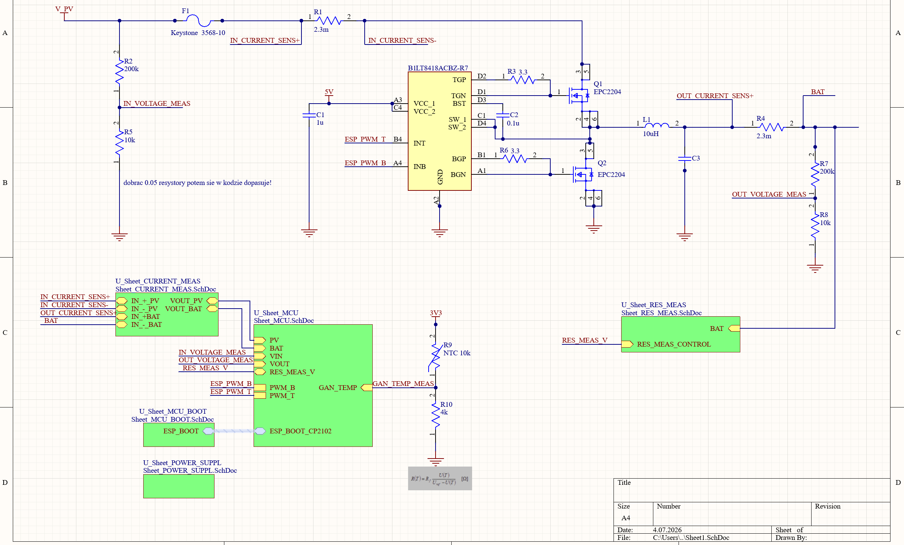

# Przetwornica i sterowanie z mppt => controller mppt do paneli PV

## Opis projektu
Projekt jest w trakcie realizacji, obecnie na etapie schematu. Pliki zawierają konkretny scheamt controllera MPPT.
Docelowe urządzenie realizowac będzie algorytm P&O do ciągłego monitorowania maksimów na krzywej panelu PV.
Rozważane jest drożenie innego algorytmu, aby usprawnić proces i odnajdywać nie tylko maksima lokalne, ale i globalne.

Na chemacie w oddzielnym Sheet przedstawiony jest układ pomiaru rezystancji wewnętrznej baterii.

---

